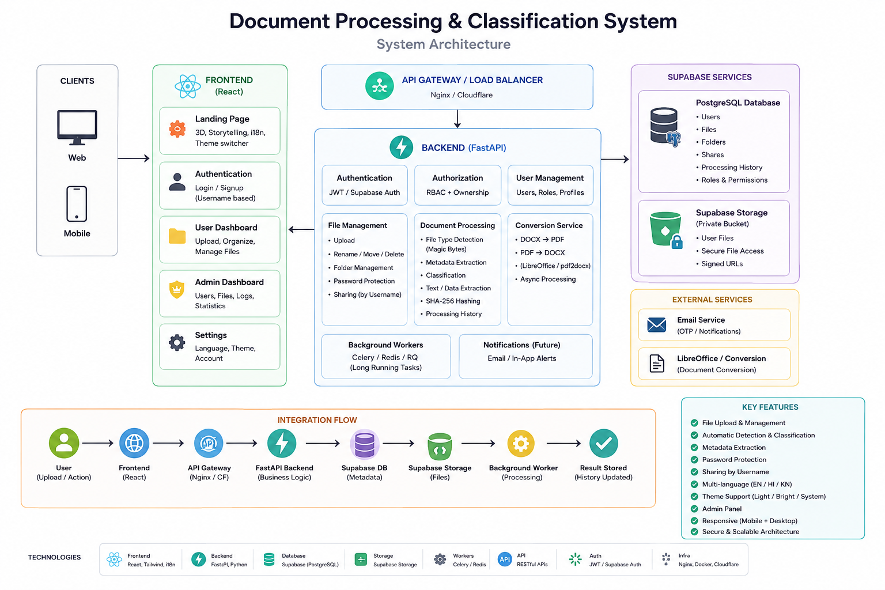

# DocumentVault

> Secure multi-user document management platform with file-type detection, AI-assisted classification, public sharing, and a community marketplace.

DocumentVault lets users upload PDF/DOCX/XLSX/PPTX files, automatically extracts metadata, classifies content, organizes documents into folders, and shares them with other users — all with server-side authorization. It also includes a public file/folder system with optional password protection, a community where users can request and offer documents, and a fully separate admin control center.

## Features

### Document Processing
- **File-type detection** via extension mapping + MIME type validation
- **Metadata extraction** for PDF (PyMuPDF), DOCX (python-docx), XLSX (openpyxl), PPTX (python-pptx)
- **Rule-based classification** (invoice, contract, receipt, tax document, etc.)
- **Background processing** via FastAPI BackgroundTasks
- **Failure tracking** with `processing_status` and `processing_error` fields

### File Management
- Per-user private workspace
- Nested folders (unlimited depth)
- Search by filename (trigram index on PostgreSQL)
- Sort by name / date / size / type
- Star / unstar documents
- Lock with password (bcrypt hashed, server-side verified)
- Rename, move, delete with cascading folder cleanup
- Drag-and-drop upload, multi-file, paste-to-upload

### Sharing
- Share documents with specific users by username
- Permission levels: `view` / `download`
- Revoke access
- "Shared with me" inbox

### Public Files & Folders
- Three visibility modes: `private` / `password` / `public`
- Password-protected public downloads (bcrypt-hashed)
- Public discovery at `/public/documents/:id` (no login required)
- Storage bucket stays **private** — public access is mediated through time-limited signed URLs (15-min TTL)
- Folder visibility inheritance (children remain independent)

### Community
- Public document request feed
- Offer your own public documents in response
- State machine: `Request → Offer → Transfer`
- Accepted offers create an **independent owned copy** in the requester's `Community Received` folder
- "Save to My Workspace" copies any public document directly
- Reporting system for moderation

### Admin Control Center
- **Separate login** at `/admin/login` (distinct visual identity)
- Same authentication, `role='admin'` gate enforced server-side
- Users, Documents, Processing, Sharing, Storage, Security, Activity dashboards
- Report review and resolution
- Normal users get 403 on every `/api/admin/*` route

### Internationalization
- English, Hindi, Kannada
- All user-facing strings extracted to JSON locale files
- Persisted language preference

### Theming
- Light / Bright (dark) / System
- Persisted to `localStorage`
- `html.dark` / `html.bright` classes sync Tailwind `dark:` utilities

## Architecture



```
Browser → Frontend (React SPA) → Backend (FastAPI) → PostgreSQL + Supabase Storage
```

- **Frontend (React)** — Vite + TypeScript SPA. Landing page, authentication, user dashboard, admin dashboard, and settings. Communicates with the backend via REST API.
- **Backend (FastAPI)** — Handles authentication (JWT), authorization (ownership + RBAC), user management, file management, document processing (type detection, metadata extraction, classification), and background workers.
- **Database + Storage** — PostgreSQL via Supabase pooler (users, files, folders, shares, processing history) and a **private** Supabase Storage bucket. Files are served via time-limited signed URLs — the bucket is never made public.

### Request Flow
1. Client uploads file via `POST /api/documents/upload` (multipart)
2. Backend reads bytes, computes SHA-256 hash, checks for duplicates
3. **File detector** classifies by extension + validates MIME type
4. Rejected: client gets `ValidationError`
5. Accepted: stored in Supabase Storage at `{user_id}/files/{doc_id}/{filename}` via **service-role key** (private bucket)
6. Document row created in PostgreSQL
7. Background task: extract metadata → classify → update `processing_status`

### Authorization Layers
- **Route dependency**: `get_current_user_id` validates the JWT cookie → user_id
- **Ownership check**: `get_document(doc_id, user_id)` → `ForbiddenError` if not owner
- **Admin gate**: `require_admin` dependency → 403 for non-admin
- **Sharing**: explicit `shares` table grants access
- **Public**: visibility column + (optional) bcrypt password verification at the public endpoint
- **Database RLS**: defense-in-depth on top of FastAPI checks (Supabase policies)

## Technology Stack

### Frontend
- **React 18.3.1** + **Vite 5** + **TypeScript 5**
- **TanStack Query 5** for server state
- **Zustand 4** for client state
- **framer-motion 11** for animations
- **TailwindCSS 3.4** for styling
- **react-i18next 17** for translations
- **react-dropzone 14** for upload
- **Axios** for HTTP, **date-fns** for dates, **lucide-react** for icons

### Backend
- **FastAPI 0.108+** with async route handlers
- **SQLAlchemy 2** (sync session) + **psycopg2**
- **Pydantic 2** + **pydantic-settings** for config/validation
- **Supabase 2** Python client for storage
- **python-jose** for JWT
- **passlib[bcrypt]** for password hashing
- **PyMuPDF / python-docx / openpyxl / python-pptx** for extractors

### Database / Storage
- **PostgreSQL 15+** via Supabase pooler
- Row-Level Security policies on every table
- Trigram index for fuzzy filename search
- **Supabase Storage** with private bucket + time-limited signed URLs

## Requirements

### System
- Python 3.11+
- Node.js 18+

### Accounts
- A Supabase project ([supabase.com](https://supabase.com))

## Installation

```bash
git clone https://github.com/Dibya81/Mr_File.git documentvault
cd documentvault

# Backend
cd backend
python -m venv venv
source venv/bin/activate
pip install -r requirements.txt
cp .env.example .env
# Edit .env with your Supabase credentials
cd ..

# Frontend
cd frontend
npm install
cp .env.example .env  # if needed
cd ..
```

## Environment Variables

### Backend (`backend/.env`)

| Variable | Required | Description |
|---|---|---|
| `SUPABASE_URL` | Yes | Supabase project URL (e.g. `https://abc.supabase.co`) |
| `SUPABASE_ANON_KEY` | Yes | Supabase anon (publishable) key |
| `SUPABASE_SERVICE_ROLE_KEY` | Yes | Supabase service-role key — backend only, never exposed to frontend |
| `DATABASE_URL` | Yes | PostgreSQL connection string. URL-encode special chars in password (`@` → `%40`, `!` → `%21`) |
| `JWT_SECRET` | Yes | Random ≥32-char string. Used to sign session JWTs |
| `JWT_ALGORITHM` | No | Default `HS256` |
| `JWT_EXPIRATION_MINUTES` | No | Default `1440` (24h) |
| `STORAGE_BUCKET` | No | Default `documents` |
| `MAX_FILE_SIZE` | No | Bytes, default 52428800 (50 MB) |
| `CORS_ORIGINS` | Yes | JSON array or comma-separated origins, e.g. `["https://app.example.com"]` or `https://app.example.com,https://example.com` |

### Frontend (`frontend/.env`)

| Variable | Required | Description |
|---|---|---|
| `VITE_API_BASE_URL` | No | Backend URL for production (e.g. `https://api.example.com`). Leave empty to use `/api` (works behind a reverse proxy). |

For development, Vite proxies `/api` to the backend via `VITE_API_TARGET` (in `vite.config.ts`). Override with:
```
VITE_API_TARGET=http://localhost:8001 npm run dev
```

## Database Setup

The repository includes one SQL migration at `backend/migrations/001_public_community.sql`. It creates the public file/folder system, community tables, and reports.

Open the SQL Editor in your Supabase dashboard and run that file. Or via psql:
```bash
cd backend
PGPASSWORD='YOUR_PASSWORD' psql "$DATABASE_URL" -f migrations/001_public_community.sql
```

If you cannot reach the pooler via psql, the project also includes `run_migration.py`:
```bash
cd backend
source venv/bin/activate
python run_migration.py
```

The base tables (users, documents, folders, shares, processing_jobs) are managed by the backend via SQLAlchemy. If you are starting with a fresh Supabase project, you will need to ensure these tables exist — adjust the SQLAlchemy models and run an `Base.metadata.create_all()` against the database, or create the schema manually to match.

### Storage bucket
In the Supabase dashboard: **Storage → Create bucket**:
- Name: `documents`
- Public: **off** (bucket is private)
- File size limit: 50 MB (or your `MAX_FILE_SIZE`)

No additional storage policies are needed — the backend uses the service-role key, bypassing RLS on storage operations.

## Running

### Backend
```bash
cd backend
source venv/bin/activate
uvicorn app.main:app --host 0.0.0.0 --port 8001 --reload
```

- API: `http://127.0.0.1:8001`
- Interactive docs: `http://127.0.0.1:8001/docs`
- Health check: `curl http://127.0.0.1:8001/`

### Frontend (development)
```bash
cd frontend
npm run dev
```
- App: `http://localhost:5173`
- Vite proxies `/api/*` to the backend.

### Frontend (production build)
```bash
cd frontend
npm run build
# Output in dist/ — serve with nginx, Caddy, Vercel, etc.
```

## API Documentation

FastAPI auto-generates:
- Swagger UI: `http://localhost:8001/docs`
- ReDoc: `http://localhost:8001/redoc`

## Postman

A Postman collection is provided at `docs/postman_collection.json`.

Import:
1. Open Postman → Import → File → select `docs/postman_collection.json`
2. Set collection variables: `base_url`, `session_token` (or use the cookie jar)
3. Run `Auth → Login` first; subsequent requests will use the session cookie

## User Features

1. **Sign up** at `/signup` — username, name, email, password
2. **Log in** at `/login` — email/username + password
3. **Upload** — drag files into the dashboard, or click Upload
4. **Organize** — create folders, drag files into them
5. **Lock** a file with a password (in file details panel)
6. **Share** a file with another user by username (in file details panel)
7. **Make public** — change visibility in file details; share the public link
8. **Community** — request documents, offer your own, accept offers
9. **Settings** — change theme, language, profile

## Community

The community is a marketplace for documents. Flow:

```
User A creates Request
        ↓
User B offers a public document
        ↓
User A accepts
        ↓
System creates an independent copy
        ↓
Copy appears in User A's "Community Received" folder
```

User B retains the original; User A owns the copy outright.

## Admin

- Log in at `/admin/login` (must be a user with `role='admin'`)
- Default route after login: `/admin` (overview dashboard)
- Manage: users, documents, processing jobs, sharing, storage, security events, activity, reports

To make a user an admin, run in the Supabase SQL editor:
```sql
UPDATE users SET role = 'admin' WHERE username = 'YOUR_USERNAME';
```

## Security

- **Passwords**: bcrypt-hashed (passlib), never returned in API responses
- **JWT cookies**: HttpOnly, `SameSite=None; Secure` in production (required for cross-origin deployments like Vercel → Render), `SameSite=Lax` for same-origin
- **Backend enforces all authorization** — frontend restrictions are UX only
- **Public files** served via 15-minute signed URLs; bucket itself is private
- **Password-protected public files**: bcrypt verification at download time
- **RLS**: defense-in-depth on every table
- **CORS**: configurable, no wildcard in production
- **No secrets in frontend** — only anon key (Supabase service-role is backend-only)

## Deployment

### Live demo
- Frontend: `https://mr-file.vercel.app`
- Backend: `https://mr-file.onrender.com`

### Frontend
Build static files and serve with any static host (Vercel, Netlify, nginx, etc.):

**Option A — Reverse proxy (recommended for same-origin API calls):**
```nginx
server {
  listen 80;
  server_name app.example.com;
  root /var/www/documentvault/dist;
  index index.html;
  location / { try_files $uri /index.html; }
  location /api/ { proxy_pass http://127.0.0.1:8001/api/; }
}
```

**Option B — Separate hosting (use env var):**
```bash
# In frontend/.env.production:
VITE_API_BASE_URL=https://api.example.com/api
npm run build
# Serve dist/ on your host
```

**Vercel specifics:**
- Framework preset: Vite
- `vercel.json` is included with SPA rewrites (any non-asset, non-api path falls through to `index.html`)
- Set `VITE_API_BASE_URL=https://YOUR_BACKEND/api` in Vercel project settings

### Backend
Use a process manager like `systemd` or `supervisord`, or deploy to Render/Railway/Fly:

**Render Web Service:**
- Build command: `pip install -r requirements.txt`
- Start command: `uvicorn app.main:app --host 0.0.0.0 --port $PORT`
- Set all env vars from the table above in the Render dashboard
- `CORS_ORIGINS` must include your frontend URL (e.g. `["https://your-app.vercel.app"]`)

**systemd example:**
```ini
[program:documentvault]
command=/var/www/documentvault/backend/venv/bin/uvicorn app.main:app --host 127.0.0.1 --port 8001
directory=/var/www/documentvault/backend
autostart=true
autorestart=true
environment=ENV=production
```

Always run behind HTTPS (Caddy, nginx, Cloudflare, Render-managed certs).

## Troubleshooting

| Problem | Solution |
|---|---|
| `psycopg2.OperationalError: could not translate host name` | Your `DATABASE_URL` has unencoded special chars. URL-encode the password: `@` → `%40`, `!` → `%21`, `#` → `%23` |
| Upload fails with `Unsupported file type` | The detector only accepts known extensions. See `EXTENSION_TYPE_MAP` in `app/processors/detector.py` |
| Login fails with `Invalid credentials` | Check username/email case-sensitivity — backend normalizes email but not username |
| 403 on admin routes | Your user doesn't have `role='admin'` — promote via SQL (see Admin) |
| Frontend can't reach backend in dev | Vite proxy uses `http://127.0.0.1:8001` by default. Override with `VITE_API_TARGET` |

## Known Limitations

- **No 2FA** — single-factor password auth
- **No real-time collaboration** — folder changes are not pushed to other clients
- **No OCR for scanned PDFs** — only text-layer extraction
- **Workers run in-process** — BackgroundTasks are not a separate queue; for production-scale, consider Celery or RQ

## Manual Steps Before Deployment

1. Run the SQL migration in Supabase SQL editor (`backend/migrations/001_public_community.sql`)
2. Create the `documents` storage bucket (private)
3. Promote at least one user to `admin` role via SQL
4. Generate a strong `JWT_SECRET`: `python -c "import secrets; print(secrets.token_urlsafe(48))"`
5. Configure `CORS_ORIGINS` with your production frontend domain(s) (JSON array)
6. For separately hosted frontend: set `VITE_API_BASE_URL=https://YOUR_BACKEND/api` (include the `/api` suffix — backend routes are mounted there)
7. Cookies use `SameSite=None; Secure` for cross-origin (Vercel→Render). The backend sets this automatically when `ENV=production` and the request is HTTPS
8. Set up HTTPS (Caddy/Certbot/Cloudflare/Render-managed certs)
9. Configure backups for PostgreSQL (Supabase automatic backups suffice for most cases)

## Project Structure

```
documentvault/
├── backend/                    # FastAPI service
│   ├── app/
│   │   ├── api/routes/        # HTTP endpoints
│   │   ├── core/              # config, security, dependencies
│   │   ├── database/          # SQLAlchemy engine
│   │   ├── models/            # SQLAlchemy ORM
│   │   ├── processors/        # file detection, extractors
│   │   ├── schemas/           # Pydantic models
│   │   ├── services/          # business logic
│   │   ├── workers/           # background tasks
│   │   └── main.py            # FastAPI app
│   ├── migrations/            # SQL migrations (public/community features)
│   ├── tests/                 # pytest tests (security + detector + classifier)
│   ├── requirements.txt
│   └── .env.example
├── frontend/                   # React SPA
│   ├── src/
│   │   ├── api/               # HTTP clients
│   │   ├── components/        # UI components
│   │   │   ├── workspace/     # user dashboard widgets
│   │   │   ├── community/     # community feature
│   │   │   ├── admin/         # admin control center
│   │   │   └── landing/       # public landing page
│   │   ├── hooks/             # React hooks
│   │   ├── layouts/           # page shells
│   │   ├── locales/           # i18n JSON files (en, hi, kn)
│   │   ├── pages/             # route components
│   │   ├── store/             # zustand stores
│   │   ├── types/             # TypeScript types
│   │   ├── utils/             # helpers
│   │   ├── App.tsx
│   │   └── main.tsx
│   ├── tailwind.config.js
│   ├── vite.config.ts
│   ├── .env.example
│   └── package.json
├── docs/
│   └── postman_collection.json
├── .gitignore
└── README.md
```

## License

Proprietary. All rights reserved.
